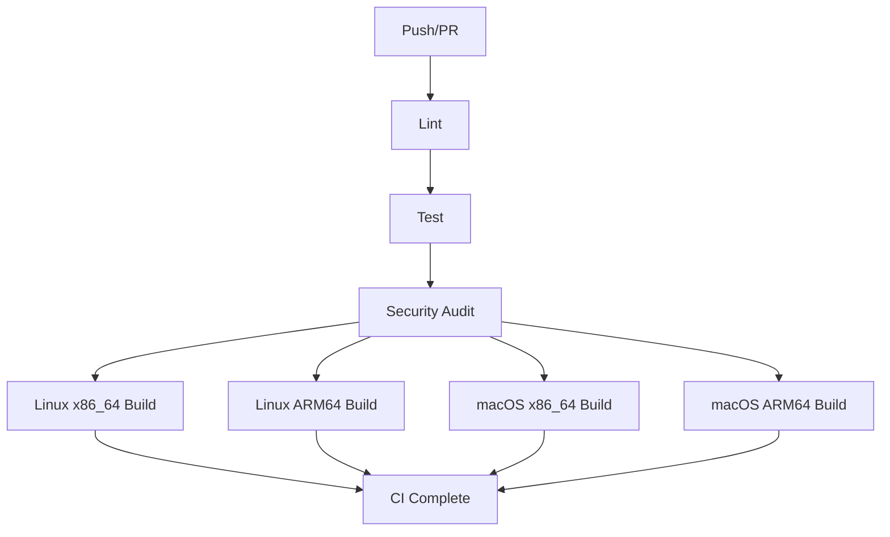

# GitHub Actions Workflows

This directory contains the CI/CD workflows for the OVC project, split into modular components for better maintainability and parallel execution.

## Workflow Structure

### 1. **Main Orchestrator**
- **`ci.yaml`** - Main CI workflow that orchestrates all other workflows
  - Defines job dependencies and execution order
  - Ensures proper sequencing: Lint → Test → Security → Builds

### 2. **Core Workflows**

#### **`lint.yaml`** - Code Linting
- Runs on Ubuntu Latest and macOS 13
- Performs:
  - Code formatting checks (`cargo fmt`)
  - Linting with Clippy (`cargo clippy`)
- **Triggers**: Push/PR to main/develop, workflow_call

#### **`test.yaml`** - Testing
- Runs on Ubuntu Latest and macOS 13
- Performs:
  - Unit tests (`cargo test`)
  - Release build tests
- **Triggers**: Push/PR to main/develop, workflow_call
- **Dependencies**: Runs after lint passes

#### **`security.yaml`** - Security Scanning
- Runs security audits using `cargo audit`
- Optional `cargo-deny` checks
- Scheduled to run daily at 2 AM UTC
- **Triggers**: Push/PR to main/develop, workflow_call, scheduled
- **Dependencies**: Runs after test passes

### 3. **Build Workflows**

All build workflows run after security audit passes and can execute in parallel:

#### **`build-linux-x86_64.yaml`** - Linux x86_64 Build
- **Runner**: `ubuntu-latest`
- **Target**: `x86_64-unknown-linux-gnu`
- Native compilation on x86_64 hardware

#### **`build-linux-arm64.yaml`** - Linux ARM64 Build  
- **Runner**: `ubuntu-24.04-arm64` (ARM Ubuntu image)
- **Target**: `aarch64-unknown-linux-gnu`
- Native compilation on ARM64 hardware

#### **`build-macos-x86_64.yaml`** - macOS x86_64 Build
- **Runner**: `ubuntu-latest`
- **Target**: `x86_64-apple-darwin`
- Cross-compilation (cargo check only)

#### **`build-macos-arm64.yaml`** - macOS ARM64 Build
- **Runner**: `ubuntu-latest`  
- **Target**: `aarch64-apple-darwin`
- Cross-compilation (cargo check only)

### 4. **Utility Workflows**

#### **`cache.yaml`** - Caching Setup
- Reusable workflow for cargo registry and target caching
- Accepts parameters for cache key prefixes and targets
- Can be called by other workflows for consistent caching

## Execution Flow

## Key Features

- **Parallel Execution**: Build jobs run in parallel after security passes
- **Native ARM64**: Uses ARM Ubuntu runners for true ARM64 native builds
- **Modular Design**: Each workflow can be run independently
- **Efficient Caching**: Separate cache keys for each target architecture
- **Proper Dependencies**: Ensures tests pass before builds run
- **Security First**: Security audit gates all build operations

## Runner Images

- **Ubuntu Latest**: Standard x86_64 Ubuntu for Linux x86_64 and macOS cross-compilation
- **Ubuntu 24.04 ARM64**: ARM Ubuntu image for native ARM64 Linux builds  
- **macOS 13**: Specific macOS version for consistent testing environment

## Usage

### Running Individual Workflows
Each workflow can be triggered independently via `workflow_call` or their specific triggers.

### Adding New Targets
1. Create new build workflow file following the naming pattern
2. Add the new job to `ci.yaml` orchestrator
3. Update dependencies in the `ci-complete` job

### Modifying Caching
The `cache.yaml` workflow provides a reusable caching solution that can be called from other workflows if needed. 